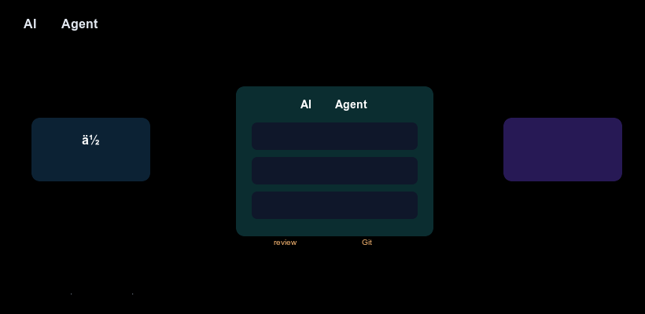

你大概听过这种说法：现在写代码可以让 AI 帮着干。然后一搜，蹦出 Claude Code、Codex、Gemini CLI、Cursor、Copilot 一长串名字，都说自己厉害。

如果你基本没碰过编程，或者会一点但没用过这些工具，这篇就是为你写的。我们不堆术语，先把"它是什么、能干吗、第一步踩在哪"讲清楚。读完你至少能判断：这东西跟我有关系吗、要不要试、从哪开始。



## 一句话：它到底是什么

先打个比方。你手机上的 ChatGPT 像个坐在旁边的参谋：你问它，它回答，但它碰不到你的电脑文件，只能说"你回去把第 3 行改成这样"，得你自己复制粘贴。

AI 编程 Agent（也叫编码智能体）是个被授权动手的助理：你告诉它"把登录页按钮改成圆角"，它会自己打开你的项目、找到代码、改好、跑一下检查，再把结果交给你确认。它不光"回答"，还能在你的电脑上"做事"。

记住三个动作，后面会反复出现：读（看懂你的代码）、写（生成或修改代码）、跑（执行命令和测试）。普通聊天 AI 只会说，Agent 会做。

## 它和你用过的东西，差在哪

和聊天机器人比：聊天机器人碰不到你的文件，给的是代码片段建议；Agent 直接在你的项目里改真实文件，改完你立刻能运行看效果。

和 IDE 里的代码补全比（比如 Copilot 补全）：补全只在你写当前这行时给提示，范围是一行或一个小函数；Agent 能跨多个文件理解整个任务（"给登录加单元测试"），自己规划步骤。

和雇真人程序员比：Agent 便宜、随叫随到、不睡觉，但不会替你做需求决策，出的代码你得自己 review。它是放大器，不是替代品。

## 主流工具有哪些（先混个脸熟）

你不用现在全搞懂，知道"它们都是同一类东西、不同厂出品"就行：

- **Claude Code** —— Anthropic 出品
- **Codex** —— OpenAI 出品
- **Gemini CLI** —— Google 出品
- **Cursor** —— 内置 Agent 的 AI 编辑器
- **GitHub Copilot CLI** —— 微软 / GitHub 出品

它们背后是不同的大模型，但对你来说用法几乎一样：装好、登录、在终端里输入命令、用中文下指令。本文后面的实操以 Claude Code 为例（新手最常碰到），换成别的工具命令不同、思路完全一致。想看横向对比，后面我们会单独写一篇《主流 AI 编程助手横评》。

## 上手前，你要准备什么

四样东西，缺一个都会卡住：

装好 Node.js（去 nodejs.org 下长期支持版），再准备一个不重要的练手文件夹，并装上 Git。Agent 改文件有风险，Git 能随时回退，这是新手的保命绳。

还要过终端这关：得会用 `cd` 进一个文件夹。不会也没事，搜"终端 cd 命令"花十分钟就够。

最后说钱的事，很多人忽略：这些工具不是免费无上限。Claude Code、Codex 都要你自己的 API key 或订阅，按用量付费。新手先用平台给的免费额度试水，别一上来开大任务。

## 跑通第一个任务：5 步

下面以 Claude Code 为例。命令名因工具而异，流程通用。全程在一个新建的测试文件夹里操作。

**第 1 步：安装并登录**

```bash
npm install -g @anthropic-ai/claude-code
claude
```

首次运行会让你登录授权，登完就进到 Agent 的交互界面（一个能对话的终端窗口）。

**第 2 步：进到练手项目**

在终端里 `cd` 进你的测试文件夹，再运行 `claude`。Agent 会"看到"这个文件夹里的所有文件，这就是它的工作台。

**第 3 步：下一条清楚的小指令**

新手最常犯的错是指令太模糊。别上来就说"帮我做个网站"，先来个明确的小任务：

```text
在当前文件夹新建一个 hello.py，打印一句"你好，AI"
```

Agent 会自己建文件、写代码，然后告诉你它做了什么。

**第 4 步：review 它改了什么**

别盲目信任。打开那个文件看一眼，或者跑 `python hello.py` 确认输出对不对。Agent 出的代码你要负最终责任，这和用聊天机器人最大的区别就在这。

**第 5 步：不满意就让它改，或回退**

觉得不对，直接说"改成打印两遍"；改坏了，用 Git 一键回到改之前。多轮对话加随时回退，就是新手最稳的姿势。

做到这步，你就入门了：你亲手让 AI 在你的项目里建了一个文件、跑通了一行代码、并且看懂了它做了什么。后面只是把"小任务"换成"大任务"。

## 新手常踩的 5 个坑

一上来就让它"做个完整 app"：任务越大越容易跑偏，你也越看不懂它改了啥。从一行代码、一个函数起步，建立"它改了什么我能看懂"的信任感，再慢慢放大。

在重要项目里直接试：Agent 会真实改你的文件。第一次永远在专门的练手文件夹里玩，并确认 Git 已初始化。

盲目复制它给的终端命令执行：有些 Agent 会自己提议运行命令（装依赖、删文件等）。看不懂的命令先问清楚再回车，尤其带 `rm`、`sudo` 的，这是安全底线。

以为它不用花钱、不用学编程：它按用量收费，而且你越懂编程、指令越准、越能看懂它的输出。学一点基础编程，收益最大。

指令太模糊然后怪它笨："优化一下性能"这种话它很难做对。说清改哪个文件、改成什么样、用什么标准判断好了，它的表现会天差地别。会提问，比会写代码更先见效。

## 客观说：它不是什么

它不是许愿机。需求不清、范围太大，它就胡来。你仍是产品经理加审核员。

它不保证代码正确或安全。它写的代码可能有 bug 甚至漏洞，必须你 review、必须跑测试。

它不会替你学编程。长期看，懂编程的人用它效率翻倍，不懂的人容易被它带偏。基础越牢，它越香。

## 写在最后

AI 编程 Agent 没那么神秘，就是个被授权动手的 AI 助理：你下指令，它改你的文件，你 review。门槛不在智商，在于你愿不愿意先建个练手文件夹、跑通那第一行 `print`。

迈出第一步之后，真正的乐趣是把重复机械的活交给它，把自己省下来做更值得思考的事。这大概就是"AI 编程"对你最有价值的地方。

> 现在就试：新建文件夹 → cd 进去 → 装好工具 → 让它写一行代码。先别想做大项目，先体验"它真的改了我的文件"。

跑通第一步之后，可以接着看：

- [用看板管理 10+ AI 编程助手——Vibe Kanban 实战](vibe-kanban-可视化看板管理AI编程-公众号版.html)（多个 Agent 一起干活怎么管）
- [给 Claude Code 穿上 GUI 外衣——Claudia 实战指南](claudia-Claude-Code的GUI外衣-公众号版.html)（给单 Agent 加个可视化界面）
- 下期预告：《2026 主流 AI 编程助手横评与选型指南》—— Claude Code / Codex / Gemini CLI / Cursor 到底先学哪个
